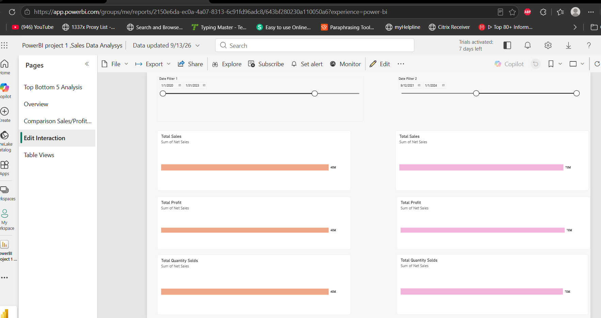

## 📊 Analysis Performed

- Analyzed the top 5 products by sales.
- Analyzed the top 5 products by quantity sold.
- Identified the bottom 5 products by quantity sold.
- Performed product-level sales analysis.
- Compared product performance based on sales and quantity sold.

## 💡 Key Insights

- Identified the highest-performing products based on total sales.
- Compared products based on quantity sold.
- Identified underperforming products based on sales and quantity sold.
- Created an interactive Power BI dashboard to support business analysis and decision-making.

## 📊 Dashboard

## 📁 Project Files

- `PowerBI project 1, Sales Data Analysis.pbix` – Power BI dashboard and data model
- `README.md` – Project documentation
- `image.png` – Dashboard preview

## 🛠️ Skills Demonstrated

**Power BI | DAX | Power Query | Data Cleaning | Data Visualization | Business Analysis**
